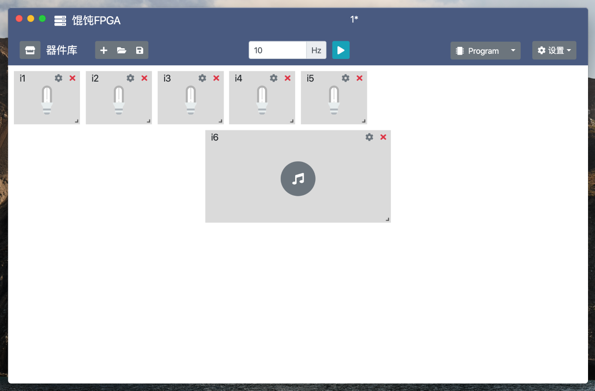
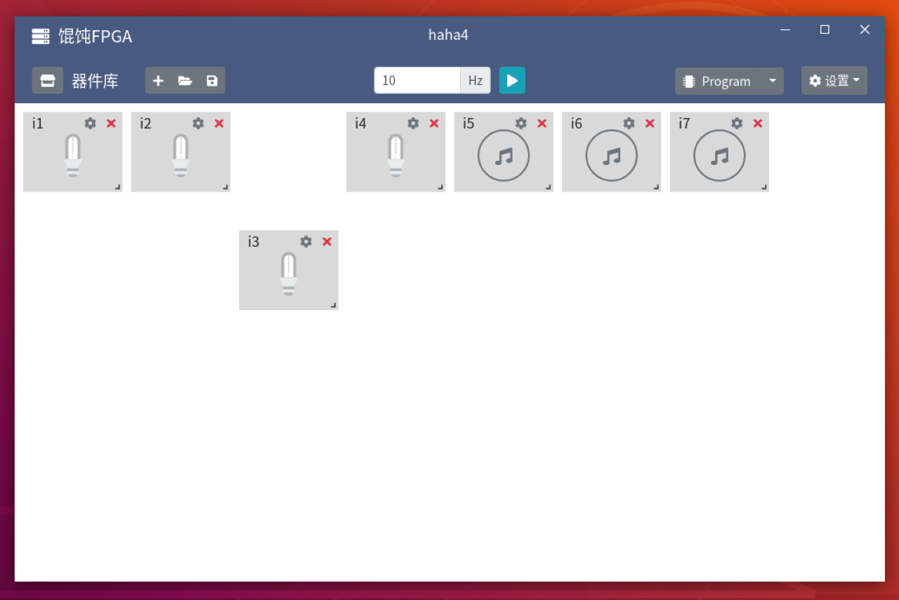

# Wonton

 **Hunger breeds discontentment**


Multilingual README：[English](./README.en-US.md), [简体中文](./README.md)


| Windows | macOS | Linux |
|:------------------------:|:------------------------:|:---------------------------:|
|  |  |  |

## Build Status

| Build Platform        | Windows                                                                                                                                                                                                                              | macOS                                                                                                                                                                                                                              | Linux                                                                                                                                                                                                                              |
|-----------------|--------------------------------------------------------------------------------------------------------------------------------------------------------------------------------------------------------------------------------------|------------------------------------------------------------------------------------------------------------------------------------------------------------------------------------------------------------------------------------|------------------------------------------------------------------------------------------------------------------------------------------------------------------------------------------------------------------------------------|
| Travis CI       | [](https://www.travis-ci.org/WangyuHello/Wonton)                                                                                                      | [](https://www.travis-ci.org/WangyuHello/Wonton)                                                                                                    | [](https://www.travis-ci.org/WangyuHello/Wonton)                                                                                                    |
| Azure Pipelines | [](https://dev.azure.com/FudanUniversity/Wonton/_build/latest?definitionId=1&branchName=master) | [](https://dev.azure.com/FudanUniversity/Wonton/_build/latest?definitionId=1&branchName=master) | [](https://dev.azure.com/FudanUniversity/Wonton/_build/latest?definitionId=1&branchName=master) |

## If you find a bug, please submit an issue

# Compilation Guide

## Dependencies

- NodeJS : https://nodejs.org/en/
- .NET Core SDK: https://dotnet.microsoft.com/download

## Compilation Steps

1. Install NodeJS https://nodejs.org/en/

    LTS and Current versions are both supported

2. Install .NET Core SDK https://dotnet.microsoft.com/download

    Requires .NET Core SDK version >= 3.1 , do not install Runtime versions

3. Run the scripts under Wonton directory

    ```
    dotnet tool install --tool-path tools Cake.Tool
    ```

    > Cake.Tool only needs to be installed once

4. Start compiling and run the scripts under Wonton directory

    Windows
    ```powershell
    .\tools\dotnet-cake
    ```

    macOS、Linux
    ```bash
    ./tools/dotnet-cake
    ```

    **If you are not in mainland China**

    Windows
    ```powershell
    .\tools\dotnet-cake -useMagic=false
    ```

    macOS、Linux
    ```bash
    ./tools/dotnet-cake -useMagic=false
    ```
5. Compiled binaries are located under **Build**

# Troubleshoot

#### Can not download Electron

1. Delete Wonton.CrossUI.Web\ClientApp\node_modules\electron

2. Find**Electron Cache Directory**. You can create it if not exists.

    Windows： ```%LOCALAPPDATA%\electron\Cache``` <br>
    macOS:  ```~/Library/Caches/electron/``` <br>
    Linux: ```~/.cache/electron/```

3. Download Electron package from taobao mirror

    Windows： https://npm.taobao.org/mirrors/electron/7.1.2/electron-v7.1.2-win32-x64.zip <br>
    macOS:    https://npm.taobao.org/mirrors/electron/7.1.2/electron-v7.1.2-darwin-x64.zip <br>
    Linux:    https://npm.taobao.org/mirrors/electron/7.1.2/electron-v7.1.2-linux-x64.zip

4.  Put the downloaded zip package into **Electron Cache Directory**

# Contributors ✨

<table>
  <tr>
    <td align="center"><a href="https://github.com/WangyuHello"><br /><sub><b>WangyuHello</b></sub></a></td>
    <td align="center"><a href="https://github.com/GeraltShi"><br /><sub><b>GeraltShi</b></sub></a></td>
  </tr>
</table>