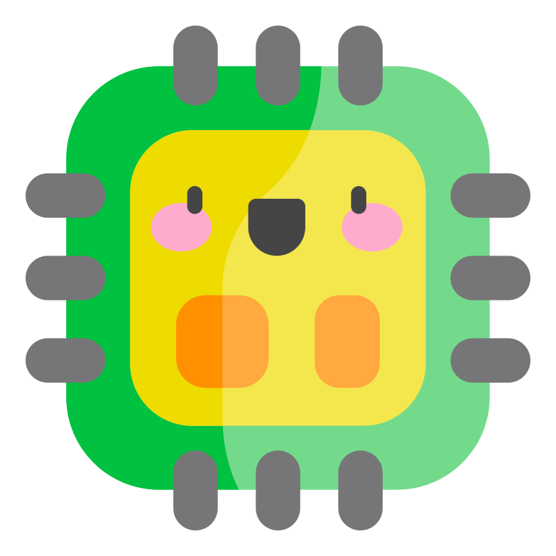

<div align="center">
    
    <br>
    <div style="font-size: 3rem; font-weight: bold;">馄饨FPGA</div>
</div>

<br>

<div align="center">

多语言文档：[English](./README.en-US.md), [简体中文](./README.md)


</div>

| Windows | macOS | Linux |
|:------------------------:|:------------------------:|:---------------------------:|
|  |  |  |

## 构建状态

| 构建平台        | Windows                                                                                                                                                                                                                              | macOS                                                                                                                                                                                                                              | Linux                                                                                                                                                                                                                              |
|-----------------|--------------------------------------------------------------------------------------------------------------------------------------------------------------------------------------------------------------------------------------|------------------------------------------------------------------------------------------------------------------------------------------------------------------------------------------------------------------------------------|------------------------------------------------------------------------------------------------------------------------------------------------------------------------------------------------------------------------------------|
| Travis CI       | [](https://www.travis-ci.org/WangyuHello/Wonton)                                                                                                      | [](https://www.travis-ci.org/WangyuHello/Wonton)                                                                                                    | [](https://www.travis-ci.org/WangyuHello/Wonton)                                                                                                    |
| Azure Pipelines | [](https://dev.azure.com/FudanUniversity/Wonton/_build/latest?definitionId=1&branchName=master) | [](https://dev.azure.com/FudanUniversity/Wonton/_build/latest?definitionId=1&branchName=master) | [](https://dev.azure.com/FudanUniversity/Wonton/_build/latest?definitionId=1&branchName=master) |


# 使用

## [发现 Bug 请提交 Issue](https://github.com/WangyuHello/Wonton/issues)
## [使用文档](https://github.com/WangyuHello/Wonton/wiki/%E8%BD%AF%E4%BB%B6%E4%BD%BF%E7%94%A8%E7%AE%80%E4%BB%8B)
## [添加新的器件](https://github.com/WangyuHello/Wonton/wiki/%E5%A6%82%E4%BD%95%E6%B7%BB%E5%8A%A0%E6%96%B0%E7%9A%84%E5%99%A8%E4%BB%B6)

# 编译指南

## 依赖软件

- NodeJS : https://nodejs.org/en/

    LTS 和 Current 版本均可

- .NET Core SDK: https://dotnet.microsoft.com/download
        
    需 >= 3.1 版本，请勿安装 Runtime 版本

## 编译步骤

1. 克隆源代码仓库

    ```bash
    git clone https://github.com/WangyuHello/Wonton.git
    ```

2. 开始编译，在 **Wonton** 目录下运行

    > 如果未安装 NodeJS 或者 .NET Core SDK，以下脚本将自动安装

    - Windows
        - 使用 **PowerShell** 运行
        ```powershell
        .\build.ps1 -useMagic
        ```
        
        - 或者使用**命令提示符**运行
        ```cmd
        .\build.cmd -useMagic
        ```
        
        - 也可双击 **build.cmd** 文件

    - macOS、Linux
        ```bash
        ./build.bash -useMagic
        ```

    > 如果是海外用户，请去除 -useMagic 选项

3. 编译后的文件在 **Build** 目录下

# 驱动编译指南

## 依赖软件

### Windows

- Visual Studio 2019 (MSVC 142)

### macOS

- Xcode
- cmake
- autoconf
- automake
- libtool
- m4

### Linux

- gcc
- cmake
- autoconf
- automake
- libtool
- m4

## 编译步骤

1. 将 **NativeDeps.zip** 压缩包复制到 **Wonton** 目录下，其余步骤同[编译步骤](##编译步骤)

    *驱动代码未开源*

2. 如果想要撤销驱动编译，请删除 **NativeDeps.zip** 、VLFDDriver、SharpVLFD目录。

# 问题解决

#### Electron无法下载

1. 删除 Wonton.CrossUI.Web\ClientApp\node_modules\electron 目录

2. 找到**Electron缓存目录**，如果没有可自行创建。

    Windows： ```%LOCALAPPDATA%\electron\Cache``` <br>
    macOS:  ```~/Library/Caches/electron/``` <br>
    Linux: ```~/.cache/electron/```

3. 从淘宝镜像下载Electron包

    Windows： https://npm.taobao.org/mirrors/electron/8.2.0/electron-v8.2.0-win32-x64.zip <br>
    macOS:    https://npm.taobao.org/mirrors/electron/8.2.0/electron-v8.2.0-darwin-x64.zip <br>
    Linux:    https://npm.taobao.org/mirrors/electron/8.2.0/electron-v8.2.0-linux-x64.zip


4. 将上述下载的zip包存放在Electron缓存目录中即可

# 贡献 ✨

<table>
  <tr>
    <td align="center"><a href="https://github.com/WangyuHello"><br /><sub><b>WangyuHello</b></sub></a></td>
    <td align="center"><a href="https://github.com/GeraltShi"><br /><sub><b>GeraltShi</b></sub></a></td>
  </tr>
</table>

<!-- https://api.github.com/repos/WangyuHello/Wonton/contributors?page=1&per_page=100 -->