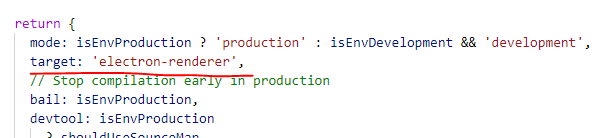

# FudanFPGAInterface

为复旦微电子FPGA课程量身打造的教学辅助软件。支持Windows和macOS操作系统。

多语言文档：[English](./README.en-US.md), [简体中文](./README.md)


# 编译指南

## 依赖软件

- NodeJS : https://nodejs.org/en/
- .NET Core SDK: https://dotnet.microsoft.com/download

## 编译步骤

### 首次编译

1. 安装 NodeJS https://nodejs.org/en/
    
    LTS和Current版本均可

2. 安装 .NET Core SDK https://dotnet.microsoft.com/download

    需 >= 3.1 版本，请勿安装 Runtime 版本

3. 安装 ElectronNET 

    ```powershell
    dotnet tool install -g ElectronNET.CLI
    ```

4. 在 FudanFPGA.CrossUI.Web 目录运行

    ```powershell
    dotnet build -c Release
    ```

5. 在 FudanFPGA.CrossUI.Web\ClientApp 目录运行，此步骤可能需要较长时间，视网络状况。

    ```powershell
    npm i
    ```

6. 修改 FudanFPGA.CrossUI.Web\ClientApp\node_modules\react-scripts\config\webpack.config.js 文件, 在 ```return``` 函数中添加一个字段 ```target: 'electron-renderer'``` 然后保存

    

7. 在 FudanFPGA.CrossUI.Web 目录运行，此步骤可能需要较长时间，视网络状况。

    编译 macOS 版本
    ```powershell
    ~/.dotnet/tools/electronize build /target osx /package-json ./ClientApp/electron.package.json
    ```

    或者，编译 Windows 版本
    ```powershell
    ~/.dotnet/tools/electronize build /target win /package-json .\ClientApp\electron.package.json
    ```
8. 编译后的文件在 FudanFPGA.CrossUI.Web\bin\Desktop 目录下

### 非首次编译

1. 在 FudanFPGA.CrossUI.Web 目录运行

    编译 macOS 版本
    ```powershell
    ~/.dotnet/tools/electronize build /target osx /package-json ./ClientApp/electron.package.json
    ```

    或者，编译 Windows 版本
    ```powershell
    ~/.dotnet/tools/electronize build /target win /package-json .\ClientApp\electron.package.json
    ```
2. 编译后的文件在 FudanFPGA.CrossUI.Web\bin\Desktop 目录下